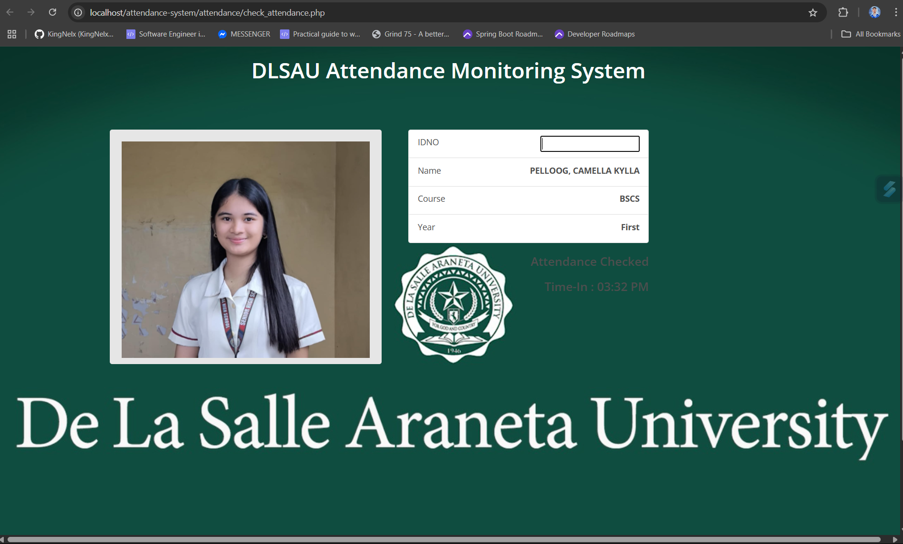
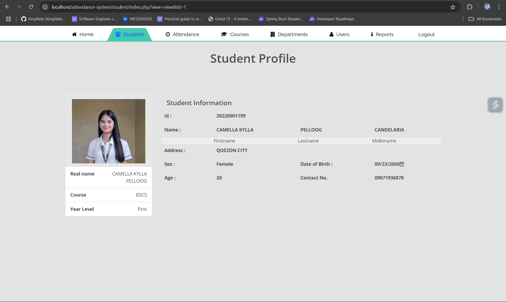
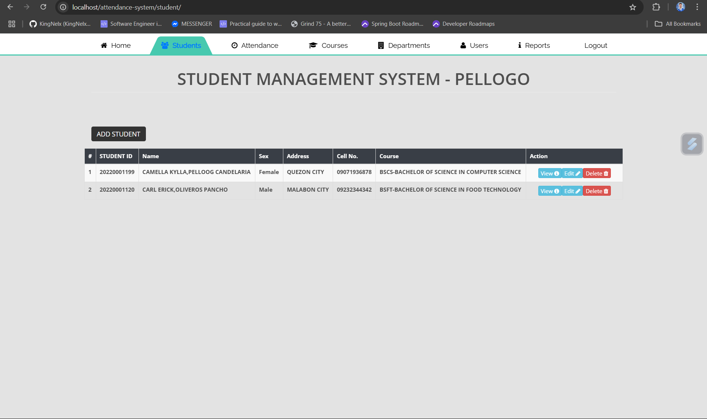

# 📚 Attendance-Logger System

The **Attendance-Logger System** is a web-based application designed to help schools efficiently track student attendance. It allows students to log their **time-in and time-out** using their **School ID**, while administrators manage student records, view logs, and generate attendance reports.


## 🚀 Features




### 🧑‍🎓 Student Attendance
- Students input their **School ID** to log time-in and time-out.
- Automatically detects whether the student is logging in or out.
- Simple and mobile-responsive interface using Bootstrap.

### 🛠️ Admin Dashboard
- **Student Management**
  - Add, edit, or delete student records.
- **Attendance Logs**
  - View logs in organized tables or tabs:
    - All Logs
    - Time-In Logs
    - Time-Out Logs
- **Reports**
  - Filter attendance by date, student ID, or type.
  - Generate and print daily, weekly, or monthly reports.

---

## 🧰 Technologies Used

- **Frontend**: HTML5, CSS3, JavaScript, Bootstrap 5
- **Backend**: PHP 7+
- **Database**: MySQL (via phpMyAdmin)
- **Local Server**: XAMPP or Laragon

---

## 🖥️ How to Run the Project

1. Clone or download the project:
   ```bash
   git clone https://github.com/yourusername/attendance-logger.git
Start your local server using XAMPP or Laragon.

Import the database:

Visit http://localhost/phpmyadmin

Create a new database (e.g., attendance_db)

Import the provided database.sql file

Configure the database in includes/db.php:


$conn = new mysqli("localhost", "root", "", "attendance_db");
Open the application in your browser:

Student page: http://localhost/attendance-logger/index.php

Admin dashboard: http://localhost/attendance-logger/admin/dashboard.php

📦 Future Improvements
Admin login and authentication

Role-based access for teachers or staff

QR or RFID-based scanning

Dashboard graphs and analytics

Email notifications for absences or tardiness

✏️ Modification Notice
This system was developed by modifying and extending an existing codebase to meet new functional requirements, including:

Student ID-based attendance logging

Admin panel with student management

Categorized attendance logs and report generation

All customizations were made by John Paul Pellogo as part of a school project, using core web technologies like PHP, MySQL, JavaScript, and Bootstrap.

📧 Contact
John Paul Pellogo
Graduating Computer Science Student
📩 Email: jpellogo01@gmail.com
📁 GitHub: [Insert your GitHub profile link]

📃 License
This project is open-source and available under the MIT License.


---

✅ You can now paste this directly into your `README.md` file on GitHub or inside your project folder.

Let me know if you also want:
- A custom project logo
- Screenshot section
- GitHub badge/header for stars/forks/license display